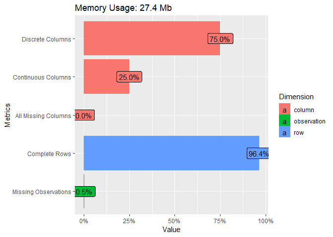
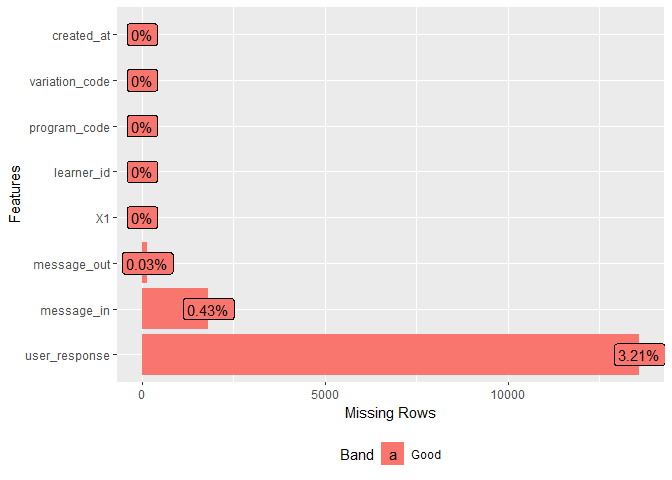

# Introduction
 

# Load the required libraries

```r
library(readr) #to load csv data.
library(dplyr) #data manipulation
library(ggplot2)
library(plotly)
library(DataExplorer)
library(naniar)
library(broom)
library(DT)
```

# Load the data

```r
housing_data<-read_csv('data/challenge 1 dataset (housing).csv')
```

```
## Warning: Missing column names filled in: 'X1' [1]
```

```
## Parsed with column specification:
## cols(
##   X1 = col_double(),
##   learner_id = col_double(),
##   program_code = col_character(),
##   variation_code = col_character(),
##   message_in = col_character(),
##   message_out = col_character(),
##   created_at = col_datetime(format = ""),
##   user_response = col_character()
## )
```

# IDA

Introduce the data

```r
introduce(housing_data)
```

```
## # A tibble: 1 x 9
##     rows columns discrete_columns continuous_colu~ all_missing_col~
##    <int>   <int>            <int>            <int>            <int>
## 1 422868       8                6                2                0
## # ... with 4 more variables: total_missing_values <int>,
## #   complete_rows <int>, total_observations <int>, memory_usage <dbl>
```

Plot the data introduction

```r
plot_intro(housing_data)
```

<!-- -->

Look at the columns that have missing values

```r
miss_var_summary(housing_data)
```

```
## # A tibble: 8 x 3
##   variable       n_miss pct_miss
##   <chr>           <int>    <dbl>
## 1 user_response   13593   3.21  
## 2 message_in       1813   0.429 
## 3 message_out       146   0.0345
## 4 X1                  0   0     
## 5 learner_id          0   0     
## 6 program_code        0   0     
## 7 variation_code      0   0     
## 8 created_at          0   0
```

Plot the missing data

```r
plot_missing(housing_data)
```

<!-- -->

The columns that have missing data have less than 5% of their values missing and since we have relatively many observations we may just drop the observations that have these missing values. However I will retain these observations for the purposes of answering the questions.

Look at the internal structure

```r
glimpse(housing_data)
```

```
## Observations: 422,868
## Variables: 8
## $ X1             <dbl> 1, 2, 3, 4, 5, 6, 7, 8, 9, 10, 11, 12, 13, 14, ...
## $ learner_id     <dbl> 8, 8, 8, 8, 8, 11, 11, 11, 11, 11, 11, 11, 11, ...
## $ program_code   <chr> "HFH", "HFH", "PL", "PL", "PL", "HFH", "HFH", "...
## $ variation_code <chr> "HFH", "HFH", "PL", "PL", "PL", "HFH", "HFH", "...
## $ message_in     <chr> "hfh", "a", "1", "a", "a", "HFH", "A", "1", "A"...
## $ message_out    <chr> "Housing is a basic need but not everyone can a...
## $ created_at     <dttm> 2017-12-20 11:55:19, 2017-12-20 11:56:19, 2017...
## $ user_response  <chr> "a", "1", "a", "a", "ACCESS|DIGI", "A", "1", "A...
```


# Questions

## How many learners were in the housing trainings project?


```r
nrow(housing_data)
```

```
## [1] 422868
```
422868 Learners

## Which were the 3 most popular trainings? (Trainings with the most learners)

```r
housing_data%>%
  group_by(program_code)%>%tally(n='total_number_of_learners')%>%arrange(desc(total_number_of_learners))%>%head(3)
```

```
## # A tibble: 3 x 2
##   program_code total_number_of_learners
##   <chr>                           <int>
## 1 PLB                            123652
## 2 HFS                             78505
## 3 SF                              55654
```

The three most popular trainings were:

program_code                                total_number_of_learners
PLB (Plan your money to build)	            123652			
HFS	(Survey)                                78505			
SF (Select fundi)	                          55654	

## Which learner had the most interactions and how many interactions did they have?


```r
housing_data%>%
  group_by(learner_id)%>%tally(n='total_number_of_interactions')%>%arrange(desc(total_number_of_interactions))%>%head(1)
```

```
## # A tibble: 1 x 2
##   learner_id total_number_of_interactions
##        <dbl>                        <int>
## 1     648424                         1172
```

learner_id    total_number_of_interactions
648424	       1172	

## How many learners had more than 100 interactions (>100) ?


```r
housing_data%>%
  group_by(learner_id)%>%tally(n='total_number_of_interactions')%>%filter(total_number_of_interactions>100)%>%nrow()
```

```
## [1] 756
```
756

## How many learners had 100 or less interactions (<= 100)


```r
housing_data%>%
  group_by(learner_id)%>%tally(n='total_number_of_interactions')%>%filter(total_number_of_interactions <= 100)%>%nrow()
```

```
## [1] 14885
```

14885

## For the 100 or less learners derive summary statistics of their interactions count and visualize the distribution of their interaction counts (i.e interactions count is the number of interactions they had in the project).

### Derive the data for learners that had 100 or less interactions

```r
# derive data for learners that had 100 or less interactions
interactions_count_by_id<-housing_data%>%
  group_by(learner_id)%>%tally(n='interactions_count')%>%filter(interactions_count <= 100)
```

### Summary statistics

```r
summary(interactions_count_by_id$interactions_count)
```

```
##    Min. 1st Qu.  Median    Mean 3rd Qu.    Max. 
##    1.00    4.00   14.00   20.87   30.00  100.00
```

The mean is greater than the median hence interactions count is positively skewed.

### Distribution of interaction counts

```r
ggplotly(
interactions_count_by_id%>%
  ggplot(aes(interactions_count))+
  geom_histogram(bins = 10))
```

<!--html_preserve--><div id="htmlwidget-e9be95be6609a71a2f29" style="width:672px;height:480px;" class="plotly html-widget"></div>
<script type="application/json" data-for="htmlwidget-e9be95be6609a71a2f29">{"x":{"data":[{"orientation":"v","width":[11,11,11,11,11,11,11,11,11,11],"base":[0,0,0,0,0,0,0,0,0,0],"x":[0,11,22,33,44,55,66,77,88,99],"y":[4627,3368,2779,1460,1003,625,434,275,190,124],"text":["count: 4627<br />interactions_count:  0","count: 3368<br />interactions_count: 11","count: 2779<br />interactions_count: 22","count: 1460<br />interactions_count: 33","count: 1003<br />interactions_count: 44","count:  625<br />interactions_count: 55","count:  434<br />interactions_count: 66","count:  275<br />interactions_count: 77","count:  190<br />interactions_count: 88","count:  124<br />interactions_count: 99"],"type":"bar","marker":{"autocolorscale":false,"color":"rgba(89,89,89,1)","line":{"width":1.88976377952756,"color":"transparent"}},"showlegend":false,"xaxis":"x","yaxis":"y","hoverinfo":"text","frame":null}],"layout":{"margin":{"t":26.2283105022831,"r":7.30593607305936,"b":40.1826484018265,"l":48.9497716894977},"plot_bgcolor":"rgba(235,235,235,1)","paper_bgcolor":"rgba(255,255,255,1)","font":{"color":"rgba(0,0,0,1)","family":"","size":14.6118721461187},"xaxis":{"domain":[0,1],"automargin":true,"type":"linear","autorange":false,"range":[-11,110],"tickmode":"array","ticktext":["0","25","50","75","100"],"tickvals":[0,25,50,75,100],"categoryorder":"array","categoryarray":["0","25","50","75","100"],"nticks":null,"ticks":"outside","tickcolor":"rgba(51,51,51,1)","ticklen":3.65296803652968,"tickwidth":0.66417600664176,"showticklabels":true,"tickfont":{"color":"rgba(77,77,77,1)","family":"","size":11.689497716895},"tickangle":-0,"showline":false,"linecolor":null,"linewidth":0,"showgrid":true,"gridcolor":"rgba(255,255,255,1)","gridwidth":0.66417600664176,"zeroline":false,"anchor":"y","title":{"text":"interactions_count","font":{"color":"rgba(0,0,0,1)","family":"","size":14.6118721461187}},"hoverformat":".2f"},"yaxis":{"domain":[0,1],"automargin":true,"type":"linear","autorange":false,"range":[-231.35,4858.35],"tickmode":"array","ticktext":["0","1000","2000","3000","4000"],"tickvals":[2.8421709430404e-014,1000,2000,3000,4000],"categoryorder":"array","categoryarray":["0","1000","2000","3000","4000"],"nticks":null,"ticks":"outside","tickcolor":"rgba(51,51,51,1)","ticklen":3.65296803652968,"tickwidth":0.66417600664176,"showticklabels":true,"tickfont":{"color":"rgba(77,77,77,1)","family":"","size":11.689497716895},"tickangle":-0,"showline":false,"linecolor":null,"linewidth":0,"showgrid":true,"gridcolor":"rgba(255,255,255,1)","gridwidth":0.66417600664176,"zeroline":false,"anchor":"x","title":{"text":"count","font":{"color":"rgba(0,0,0,1)","family":"","size":14.6118721461187}},"hoverformat":".2f"},"shapes":[{"type":"rect","fillcolor":null,"line":{"color":null,"width":0,"linetype":[]},"yref":"paper","xref":"paper","x0":0,"x1":1,"y0":0,"y1":1}],"showlegend":false,"legend":{"bgcolor":"rgba(255,255,255,1)","bordercolor":"transparent","borderwidth":1.88976377952756,"font":{"color":"rgba(0,0,0,1)","family":"","size":11.689497716895}},"hovermode":"closest","barmode":"relative"},"config":{"doubleClick":"reset","showSendToCloud":false},"source":"A","attrs":{"23cc5f42629f":{"x":{},"type":"bar"}},"cur_data":"23cc5f42629f","visdat":{"23cc5f42629f":["function (y) ","x"]},"highlight":{"on":"plotly_click","persistent":false,"dynamic":false,"selectize":false,"opacityDim":0.2,"selected":{"opacity":1},"debounce":0},"shinyEvents":["plotly_hover","plotly_click","plotly_selected","plotly_relayout","plotly_brushed","plotly_brushing","plotly_clickannotation","plotly_doubleclick","plotly_deselect","plotly_afterplot"],"base_url":"https://plot.ly"},"evals":[],"jsHooks":[]}</script><!--/html_preserve-->


## Which day of the week had the most interactions and which had the least interactions?

### day of the week that had the most interactions

```r
housing_data%>%
  group_by(weekdays(created_at))%>%
  tally()%>%arrange(desc(n))%>%head(1)
```

```
## # A tibble: 1 x 2
##   `weekdays(created_at)`      n
##   <chr>                   <int>
## 1 Wednesday              145590
```

Wednesday with 145590 interactions.

### day of the week that had the least interactions

```r
housing_data%>%
  group_by(weekdays(created_at))%>%
  tally()%>%arrange(n)%>%head(1)
```

```
## # A tibble: 1 x 2
##   `weekdays(created_at)`     n
##   <chr>                  <int>
## 1 Monday                 14096
```

Monday with 14096 interactions.
