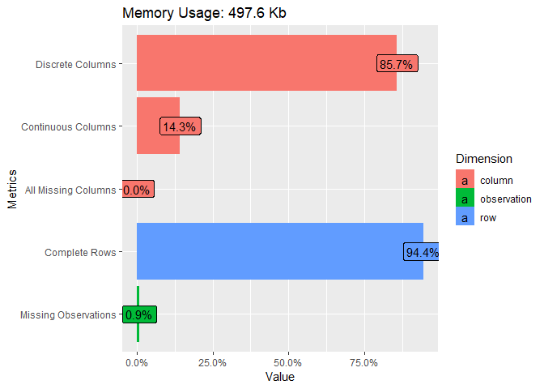
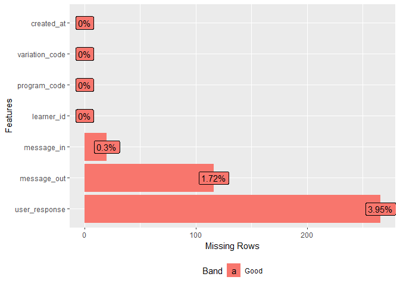
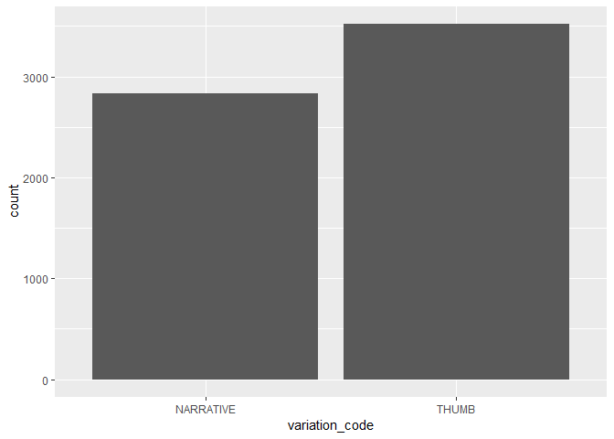

# Introduction
In 2017 Arifu designed an experiment to test whether learners preferred *narrative* or *fact based* training. 

A fertilizer training was designed with 2 variations *'THUMB'* for fact based and *'NARRATIVE'* for narrative based. 

Your task is to analyze between the two variations which was more popular. 

NB: Make the assumption the length of the training does not matter.

In addition feel free to generate any interesting insights from the dataset. Your output will be a write up and code used. Both the findings and an explanation of your method should be provided 
 

# Load the required libraries

```r
library(infer)
library(readr) #to load csv data.
library(dplyr) #data manipulation
library(ggplot2)
library(plotly)
library(DataExplorer)
library(naniar)
library(powerMediation)#power analysis

#library(pwr)
library(broom)
library(DT)

seed=2010
```

# Load the data

```r
fertilizer_data<-read_csv('data/challenge 2 dataset (fertilizer).csv')
```

# IDA

Introduce the data

```r
introduce(fertilizer_data)
```

```
## # A tibble: 1 x 9
##    rows columns discrete_columns continuous_colu~ all_missing_col~
##   <int>   <int>            <int>            <int>            <int>
## 1  6731       7                6                1                0
## # ... with 4 more variables: total_missing_values <int>,
## #   complete_rows <int>, total_observations <int>, memory_usage <dbl>
```

Plot the data introduction

```r
plot_intro(fertilizer_data)
```

<!-- -->

Look at the columns that have missing values

```r
miss_var_summary(fertilizer_data)
```

```
## # A tibble: 7 x 3
##   variable       n_miss pct_miss
##   <chr>           <int>    <dbl>
## 1 user_response     266    3.95 
## 2 message_out       116    1.72 
## 3 message_in         20    0.297
## 4 learner_id          0    0    
## 5 program_code        0    0    
## 6 variation_code      0    0    
## 7 created_at          0    0
```

Plot the missing data

```r
plot_missing(fertilizer_data)
```

<!-- -->

The columns that have missing data have less than 5% of their values missing and since we have relatively many observations we may just drop the observations that have these missing values.


```r
# drop rows with missing values
fertilizer_data<-na.omit(fertilizer_data)
```


Look at the internal structure

```r
glimpse(fertilizer_data)
```

```
## Observations: 6,352
## Variables: 7
## $ learner_id     <dbl> 164274, 164274, 164274, 164274, 164274, 164274,...
## $ program_code   <chr> "YARA", "YARA", "YARA", "YARA", "YARA", "YARA",...
## $ variation_code <chr> "NARRATIVE", "NARRATIVE", "NARRATIVE", "NARRATI...
## $ message_in     <chr> "YARA", "A", "A", "1", "A", "A", "A", "A", "A",...
## $ message_out    <chr> "(1/23) A healthy crop makes a wealthy farmer. ...
## $ created_at     <chr> "11/2/2017 14:06", "11/2/2017 14:08", "11/2/201...
## $ user_response  <chr> "A", "A", "1", "A", "A", "A", "A", "A", "2", "A...
```

# Plot of distribution of variation code

```r
fertilizer_data%>%
  ggplot(aes(variation_code))+
  geom_bar()
```

<!-- -->

From the plot we can see that *'THUMB'* for fact based training is more popular than *'NARRATIVE'* for narrative based training.

But is the variation statistically signinficant? We will have to carry out A/B testing to prove this.
 
#  Research Question

In 2017 Arifu designed an experiment to test whether learners preferred *narrative* or *fact based* training. 

A fertilizer training was designed with 2 variations *'THUMB'* for fact based and *'NARRATIVE'* for narrative based. 

Your task is to analyze between the two variations which was more popular.

# Hypothesis

H0: The difference in proportions of THUMB and NARRATIVE VARIATIONS is zero

HA: The proportion of users who preferred THUMB based training is greater than the proportion of users who preferred NARRATIVE base training.

# Variable of interest
Variation code

# Power Analysis 

Let us determine the sample size

```r
fertilizer_data%>%
  mutate()%>%
  select(variation_code)%>%table()%>%prop.table()
```

```
## .
## NARRATIVE     THUMB 
## 0.4458438 0.5541562
```


```r
total_sample_size <- SSizeLogisticBin(
  
  p1 = 0.4458438,# conversion rate in August for control group/condition 
  
  p2 = 0.5541562, # expected conversion rate in August for test group/condition, assuming a 10 percentage point increase
  
  B = 0.5, # proportion of the sample data from the test condition/group (ideally 0.5)
  
  alpha = 0.05, # significance level/p-value. The level of probability at which it is agreed that the null hypothesis will be rejected. Conventionally set at 0.05.
  
  power = 0.8 # 1-Beta. The probability of rejecting the null hypothesis when it is false and the HA is true.

 )

total_sample_size
```

```
## [1] 667
```

# Data Sampling
Now let us select a random sample of 667 trainings.

```r
#set seed
set.seed(seed)

#generate 667 random observations 
fertilizer_sample_data <- fertilizer_data%>% 
  select(variation_code)%>%
  sample_n(667) 

#view
glimpse(fertilizer_sample_data)
```

```
## Observations: 667
## Variables: 1
## $ variation_code <chr> "NARRATIVE", "NARRATIVE", "NARRATIVE", "THUMB",...
```

# Distribution
We can now observe the distributions of our two training categories. 

```r
ggplotly(
ggplot(data = fertilizer_sample_data, aes(x = variation_code)) +
  geom_bar())
```

<!--html_preserve--><div id="htmlwidget-f4e24aed0ac70e1b072c" style="width:672px;height:480px;" class="plotly html-widget"></div>
<script type="application/json" data-for="htmlwidget-f4e24aed0ac70e1b072c">{"x":{"data":[{"orientation":"v","width":[0.9,0.9],"base":[0,0],"x":[1,2],"y":[287,380],"text":["count: 287<br />variation_code: NARRATIVE","count: 380<br />variation_code: THUMB"],"type":"bar","marker":{"autocolorscale":false,"color":"rgba(89,89,89,1)","line":{"width":1.88976377952756,"color":"transparent"}},"showlegend":false,"xaxis":"x","yaxis":"y","hoverinfo":"text","frame":null}],"layout":{"margin":{"t":26.2283105022831,"r":7.30593607305936,"b":40.1826484018265,"l":43.1050228310502},"plot_bgcolor":"rgba(235,235,235,1)","paper_bgcolor":"rgba(255,255,255,1)","font":{"color":"rgba(0,0,0,1)","family":"","size":14.6118721461187},"xaxis":{"domain":[0,1],"automargin":true,"type":"linear","autorange":false,"range":[0.4,2.6],"tickmode":"array","ticktext":["NARRATIVE","THUMB"],"tickvals":[1,2],"categoryorder":"array","categoryarray":["NARRATIVE","THUMB"],"nticks":null,"ticks":"outside","tickcolor":"rgba(51,51,51,1)","ticklen":3.65296803652968,"tickwidth":0.66417600664176,"showticklabels":true,"tickfont":{"color":"rgba(77,77,77,1)","family":"","size":11.689497716895},"tickangle":-0,"showline":false,"linecolor":null,"linewidth":0,"showgrid":true,"gridcolor":"rgba(255,255,255,1)","gridwidth":0.66417600664176,"zeroline":false,"anchor":"y","title":{"text":"variation_code","font":{"color":"rgba(0,0,0,1)","family":"","size":14.6118721461187}},"hoverformat":".2f"},"yaxis":{"domain":[0,1],"automargin":true,"type":"linear","autorange":false,"range":[-19,399],"tickmode":"array","ticktext":["0","100","200","300"],"tickvals":[0,100,200,300],"categoryorder":"array","categoryarray":["0","100","200","300"],"nticks":null,"ticks":"outside","tickcolor":"rgba(51,51,51,1)","ticklen":3.65296803652968,"tickwidth":0.66417600664176,"showticklabels":true,"tickfont":{"color":"rgba(77,77,77,1)","family":"","size":11.689497716895},"tickangle":-0,"showline":false,"linecolor":null,"linewidth":0,"showgrid":true,"gridcolor":"rgba(255,255,255,1)","gridwidth":0.66417600664176,"zeroline":false,"anchor":"x","title":{"text":"count","font":{"color":"rgba(0,0,0,1)","family":"","size":14.6118721461187}},"hoverformat":".2f"},"shapes":[{"type":"rect","fillcolor":null,"line":{"color":null,"width":0,"linetype":[]},"yref":"paper","xref":"paper","x0":0,"x1":1,"y0":0,"y1":1}],"showlegend":false,"legend":{"bgcolor":"rgba(255,255,255,1)","bordercolor":"transparent","borderwidth":1.88976377952756,"font":{"color":"rgba(0,0,0,1)","family":"","size":11.689497716895}},"hovermode":"closest","barmode":"relative"},"config":{"doubleClick":"reset","showSendToCloud":false},"source":"A","attrs":{"6ac6f904d3e":{"x":{},"type":"bar"}},"cur_data":"6ac6f904d3e","visdat":{"6ac6f904d3e":["function (y) ","x"]},"highlight":{"on":"plotly_click","persistent":false,"dynamic":false,"selectize":false,"opacityDim":0.2,"selected":{"opacity":1},"debounce":0},"shinyEvents":["plotly_hover","plotly_click","plotly_selected","plotly_relayout","plotly_brushed","plotly_brushing","plotly_clickannotation","plotly_doubleclick","plotly_deselect","plotly_afterplot"],"base_url":"https://plot.ly"},"evals":[],"jsHooks":[]}</script><!--/html_preserve-->

There seems to be a higher preference for THUMB trainings.

# Test statistic

difference in proportions

# Observed difference in proportions

```r
observed_diff_in_prop<-fertilizer_sample_data%>%
  group_by(variation_code)%>%
  tally()%>%summarise(diff(n))%>%pull()

#observed_diff_in_prop

#p_hat <- fertilizer_sample_data %>% 
 # specify(response = variation_code, success = "THUMB") %>% 
 # calculate(stat = "prop")
#p_hat
```


```r
diff_prop_data<-fertilizer_sample_data%>%
  summarize(diff_in_prop=observed_diff_in_prop)

diff_prop_data
```

```
## # A tibble: 1 x 1
##   diff_in_prop
##          <int>
## 1           93
```

## Simulated Data/ Bootstrap Distribution under Null Hypothesis

```r
fertilizer_sample_data$constant<-1:nrow(fertilizer_sample_data)
```


```r
#set.seed(seed)

#boot_dist_prop <-fertilizer_sample_data%>%
 # specify(constant~variation_code, success='THUMB')%>%
 #   hypothesize(null = 'independence') %>% 
 # generate(reps = 10)%>%
 # calculate(stat = 'prop', na.rm = TRUE, order = c('THUMB','NARRATIVE'))
```

```r
##### test if sample is consistent with known population
#binom.test(x=fertilizer_sample_data$variation_code, p=0.513, alternative="greater")
```


```r
#view
#glimpse(boot_dist_prop)
```


```r
#unique(boot_dist_prop$stat)
```

